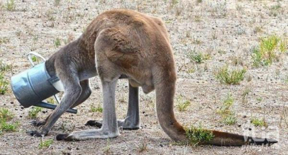

# Опоссумий вестник №3 за 19.08.2022

## ДОБРОЕ УТРО СОНЯ!

Сегодня всемирный праздник - день просыпания на работу! Его отмечают на всём земном шаре. Но сегодня наш корреспондент отправился в солнечную Австралию, чтобы посмотреть на интересный вид. Представляем вам - кенгуру!

Первый наш гость - кенгуру Джек.
-Джек, вы проспали сегодня?
-Каждый день, всегда

Рядом с Джорджем сидит местная мадонна - кенгуру Офелия. Вчерашний вечер удался на славу - она тусила до пяти утра!

-Офелия, вы выспались сегодня?
-Куда?
(Офелия любит шутки за 300, что с неё взять, глупышка. Прим.Ред)

И третий респондент на сегодня - кенгуру Крис. Он, кажется, уже встал и собирался пить утренний кофе, но застрял.

-Крис, как вы?
-(Издаёт металлические звуки)

## ВНЕЗАПНОЕ ВКЛЮЧЕНИЕ!

Наш астролог Бренда получила важное сообщение из своего магического шара - фото из будущего!
Подпись к фото: "22:15, 20 августа 2022 год. Карла Маркса 24"

Комментарий Бренды:
-Мы не знаем, что это такое, если бы мы знали, что это такое, но мы не знаем, что это такое.
(чего ещё можно ожидать, она же астролог! Прим.Ред)

Музыкальная пауза для бодрого начала дня: ОП
(ссылку научилась вставлять и менять название, прикинь? Прим.Ред)

СПАСИБО ЗА ВНИМАНИЕ. ХОРОШЕГО ДНЯ  !

Если вы хотите отписаться от рассылки, пожалуйста позвоните нам на горячую линию 8 (911) 135-25-11.
У нас нет кнопки для этого, все подписки мы отменяем вручную! С незнакомых номеров не звоните.

---
С уважением, Главный редактор "Опоссумьего вестника"
marina.baykowa@yandex.ru
8(911)135-25-11
