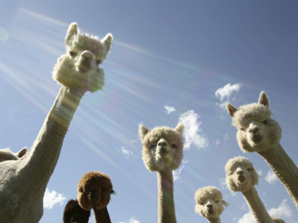
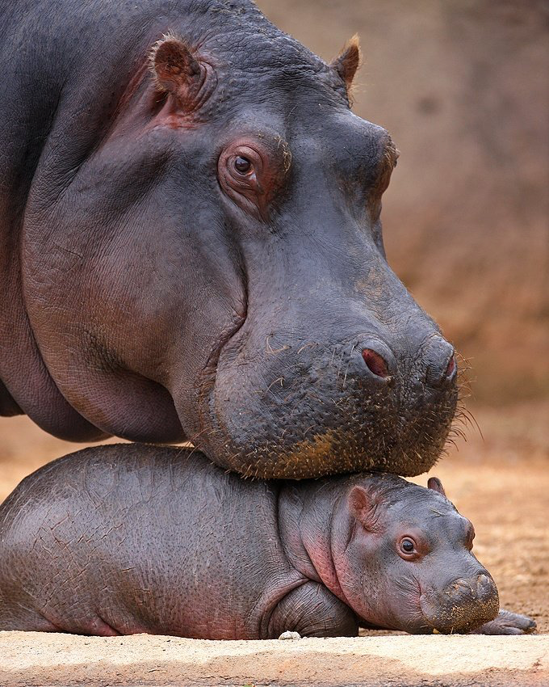
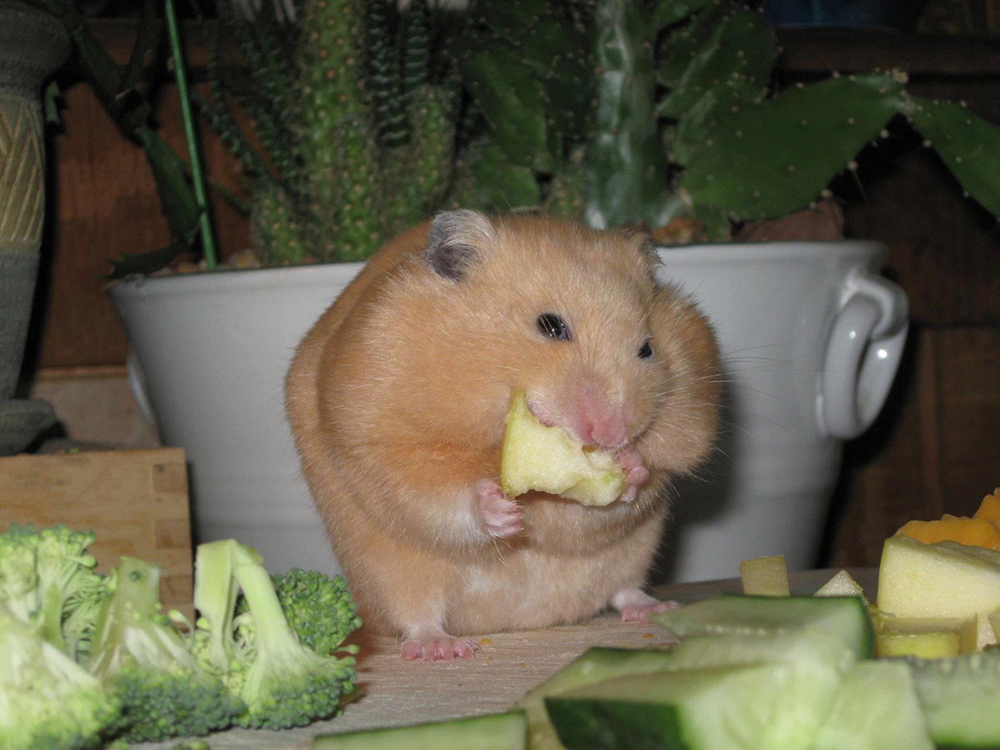
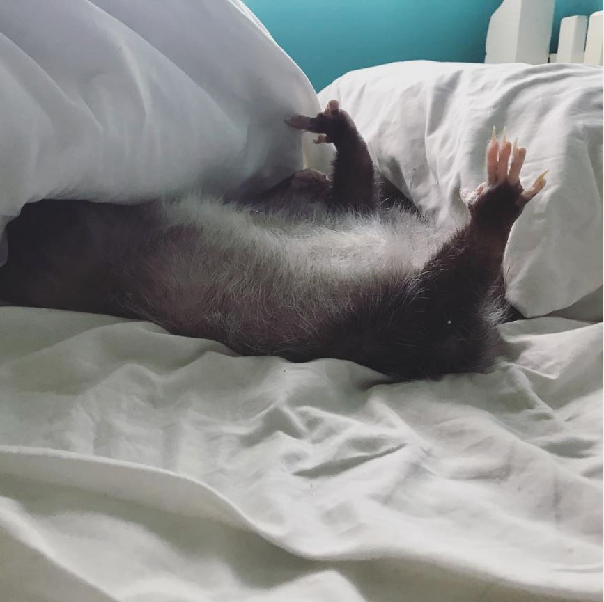

# Опоссумий вестник №8 за 30.09.2022

## ДОБРОГО УТРА!

К нам поступило важное сообщение, что один из наших читателей - высокопоставленный (выше, чем наш главный редактор примерно на голову. Прим.ред) джентельмен сегодня в плохом настроении. Мы с редакцией пришли к выводу, что нужно незамедлительно это исправлять! Поэтому приняли решение отправиться в отдалённые уголки земли, чтобы узнать, что делают её жители, чтобы не грустить.

Южноамериканские альпаки нам говорят: "Что? У тебя плохое настроение? Ты только посмотри, какие у нас дурацкие причёски! Что ты знаешь о плохом настроении, чепушило?"

Африканский бегемот делится секретом: "Люблю, когда кто-то цьомкает в спинку, это сразу поднимает настроение!"

А вот хомяку из Саратова не до разглагольствований. Он занят работой над первой ступенью пирамиды Маслоу.

Опоссуму из Невады явно хорошо. Его способ не грустить понятен без слов!

Еще мы с редакцией нашли для вас инстаграм-аккаунт* с вашими любимыми животными

А также видео, которое точно поднимает настроение! Оказывается, они моются, как кошки!

Музыкальная пауза про пусси: ОП

## СПАСИБО ЗА ВНИМАНИЕ. ЧМОК В ПУПОК. ДО ВСТРЕЧИ!

Если вы хотите отписаться от рассылки, пожалуйста позвоните нам на горячую линию 8 (911) 135-25-11.
У нас нет кнопки для этого, все подписки мы отменяем вручную! С незнакомых номеров не звоните.

*Meta признана в России экстремистской организацией

---

С уважением, Главный редактор "Опоссумьего вестника"
marina.baykowa@yandex.ru
8(911)135-25-11
