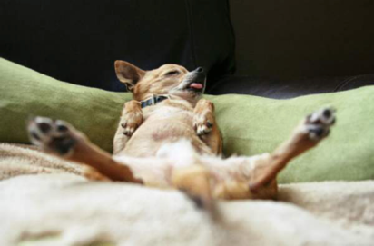
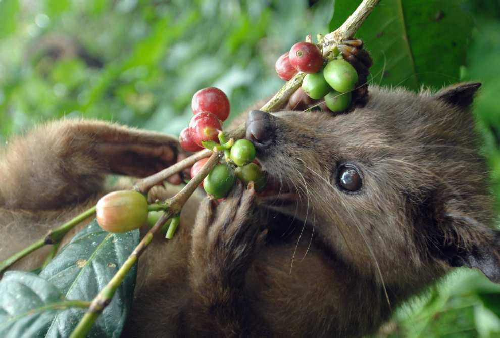
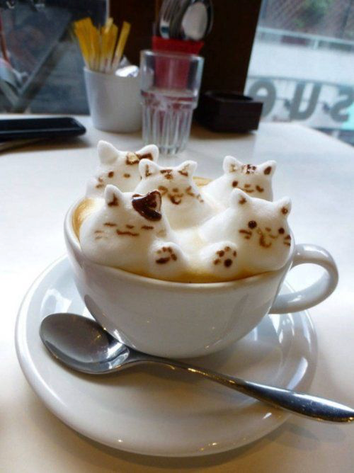
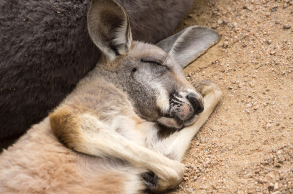

# Опоссумий вестник №12 за 17.11.2022

## ДОБРЫЙ ДЕНЬ ЛЮБИТЕЛЯМ КАКУЧИНО!

Исходя из последних новостей мы знаем, что у нашего постоянного читателя появилась кофемашина! А это значит, что сегодня мы объявляем кофейную тему!
Итак, наши профессиональные папарацци запечатлели несколько фото в доме читателя!

Стандартная позиция для сна нашего подписчика. Удобно! Ничего нигде не жмёт!

"Милая, полежи на животике, плиз"

Когда услышал, что важный клиент заделался кофеманом и помчался готовить новую партию зёрен.

Когда решил прочистить кофемашину и заодно хапнул эспрессо перед сном.

Вот такого мастерства приготовления какучино любимая ждёт от вас.

А это что? Кенгуру спит? Почему? Потому что сегодня четверг, а не пятница! Время ещё есть.

Музыкальная пауза: ОП

## СПАСИБО ЗА ВНИМАНИЕ. ДО СКОРЫХ ВСТРЕЧ!

Если вы хотите отписаться от рассылки, пожалуйста позвоните нам на горячую линию 8 (911) 135-25-11.
У нас нет кнопки для этого, все подписки мы отменяем вручную! С незнакомых номеров не звоните.

---

С уважением, Главный редактор "Опоссумьего вестника"
marina.baykowa@yandex.ru
8(911)135-25-11
