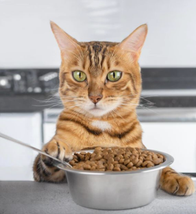
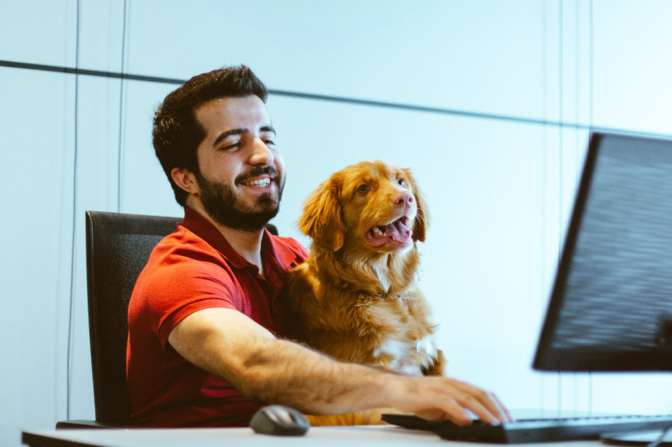
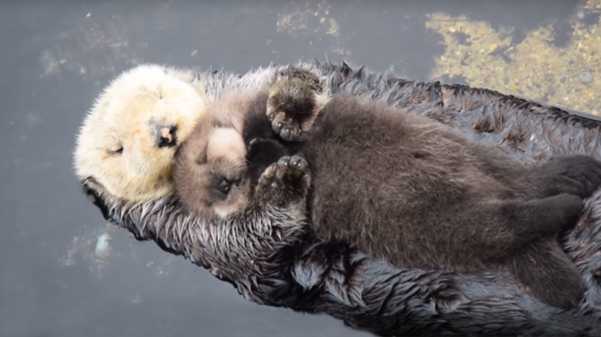

## ДОБРОЕ УТРО, БЕДОЛАГА!

С днём знаний! Уже побывал на линейке? Сидел гордо на плече 11-классника и звонил в звонок? Нет? Аааа, ты же работяга!

Сегодня мы смотрим на таких же обречённых офисных работников. И для этого отправились в близлежащий бизнес-центр.

На входе стоит ларёк со сластюшками. Офисные работники любят перекусы. Нам повезло, и сегодня там всё бесплатное, потому что на смену вышел пёс Ральф. Ральф не умеет считать и очень добрый, поэтому с радостью отдаст тебе пару чупиков и баунти.

Мы внутри ОПЕНСПЕЙСА. И сразу сталкиваемся с сурком Иззи. Он работает с клиентами, обкашливает вопросики и грызёт карандаши. Его нельзя отвлекать иначе он потеряет рабочий запал и пойдёт на кухню грызть что-то посерьёзнее карандашей.

А вот кстати и кухня. Смотри, новенький тестировщик Колбаскин не успел позавтракать и навёрстывает упущенное на работе.

Не будем заглядывать в тарелку, хотя там скорее всего сухарики с индейкой.

Хм. Как интересно. Сегодня всем работникам разрешили привести на работу своих питомцев. Поэтому пёс Патрик привёл своего человека. Что он ему там показывает? Графики? Котировки? Человек же ничего не понимает, глупыш. Ещё и такой неуклюжий, не закопал свои грязные дела в лоток в туалетной комнате.

Одного из работников нет на месте. Начальство говорит, что он живёт на Карла Маркса 24, сходим проверим, может что-то случилось?

Ааааа, нет же, всё в порядке! Вот он, Александр Гомзяков, спит в своей постельке! Ну, ну, не будем будить. Пусть набирается сил, котёнок.

## РУБРИКА ФОТО-ОХОТА

Читатель из Верх-Нейвинска прислал в редакцию фото двух преступников. Они обвиняются в пособничестве глобальному потеплению. Их объятия так горячи, что ледники тают с удвоенной скоростью. Одумайтесь, кончелыги!

(Если у вас есть информация о местонахождении преступников, просьба связаться с редакцией по телефону 8(911)135-25-11. С незнакомых номеров не звоните. Прим. ред.)

Музыкальная пауза : ОП

## СПАСИБО ЗА ВНИМАНИЕ. ХОРОШЕГО ДНЯ!

Если вы хотите отписаться от рассылки, пожалуйста позвоните нам на горячую линию 8 (911) 135-25-11.
У нас нет кнопки для этого, все подписки мы отменяем вручную! С незнакомых номеров не звоните.

---

С уважением, Главный редактор "Опоссумьего вестника"
marina.baykowa@yandex.ru
8(911)135-25-11
