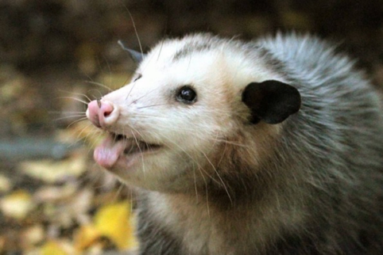

## ДОБРОГО ОБЕДА!

В нашей редакции давно ходит слушок, что наш любимый читатель довольно предвзято относится к символу нашего вестника.

Возможно, он не знает, что в мире полно и более странных зверей! Познакомимся с ними!

Начнём с Генри. Генри, а точнее Генриетта - бородатая свинья. Пышные усы среди её вида в почёте, даже у женщин!

"А каких усов добились вы?"

"Мне кажется, кто-то выкрутил нам настройки положения глаз" - говорит парочка тибетских лис Анна и Валерий.

Идеальная внешность для чтения российских новостей (прим.ред)

А вот суматранскому носорогу совсем странно, по жизни он выглядит, будто видел "некое дерьмо*"

*Мы в редакции обычно так не разговариваем. В данном случае использовалась отсылка к популярному мему. (Приме ред)
Но это всё цветочки!

На острове Мадагаскар живёт странное нечто - Руконожка.

Мы не смогли поговорить с Руконожкой Сюзи просто потому что не смогли. Сами посмотрите на неё.

Главный редактор "Оппосумьего вестника" желает вам любить опоссумов и других приятных девочек! (Одну!!!. Прим.ред)

Музыкальная пауза: ОП

## СПАСИБО ЗА ВНИМАНИЕ. ДО ВСТРЕЧИ!

Если вы хотите отписаться от рассылки, пожалуйста позвоните нам на горячую линию 8 (911) 135-25-11.
У нас нет кнопки для этого, все подписки мы отменяем вручную! С незнакомых номеров не звоните.

---

С уважением, Главный редактор "Опоссумьего вестника"
marina.baykowa@yandex.ru
8(911)135-25-11
