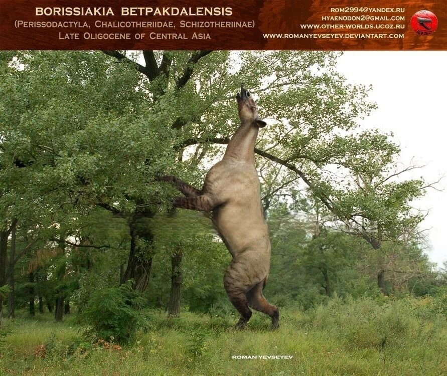

## ДОБРЫЙ ДЕНЬ В ЛАЗАРЕТЕ!

Как ваши дела? Чувствуете себя ломтём хлеба от ломки? Или болельщиком от боли в горле? Бам!

Ну а сегодня у нас модные новости и исторические находки!

Учёные обнаружили погребальные костюмы династии Хань. Мы в редакции считаем, что они отлично подходят для встреч двух вечно болеющих влюблённых.
Только посмотрите!

"Теперь она точно меня не заразит"

"Целуй"

Наш отдел палеонтологии тоже совершил открытие и обнаружил неизвестное доисторическое животное!

Встречайте: БОРИСЯКИЯ. Да, вы не ослышались. Оно так называется и правда существовало.

Звали ли всех Борисякий Борисами - мы, увы, не в курсе, потому что они вымерли.
В какой момент вестник стал сборищем странных не нужных в жизни фактов мы тоже не успели отследить.

Но есть и вечные вещи, в редакцию продолжают регулярно поступать сливы фото частной жизни одной знаменитой парочки.

"Милая, я наверное ещё тефтельки с пюре разогрею. Гиросом что-то не наелся..."
Все совпадения с реальными людьми случайны. Прим. Ред

Музыкальная пауза от Моби: ОП

## СПАСИБО ЗА ВНИМАНИЕ. НЕ МОТАЙТЕ СОПЛИ НА КУЛАК!

Если вы хотите отписаться от рассылки, пожалуйста позвоните нам на горячую линию 8 (911) 135-25-11.
У нас нет кнопки для этого, все подписки мы отменяем вручную! С незнакомых номеров не звоните.

---

С уважением, Главный редактор "Опоссумьего вестника"
marina.baykowa@yandex.ru
8(911)135-25-11
