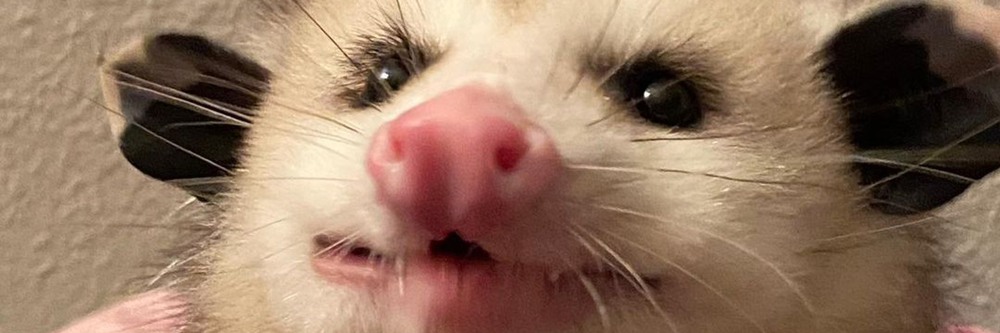
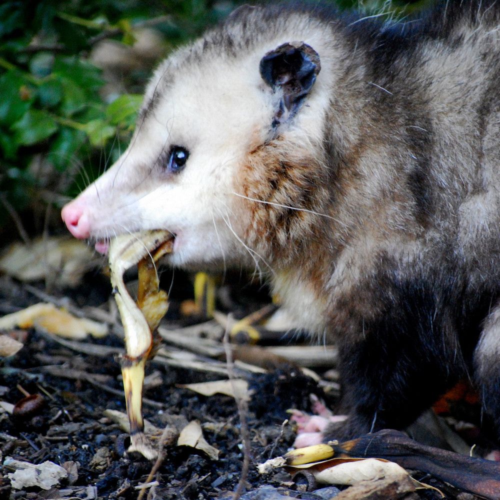
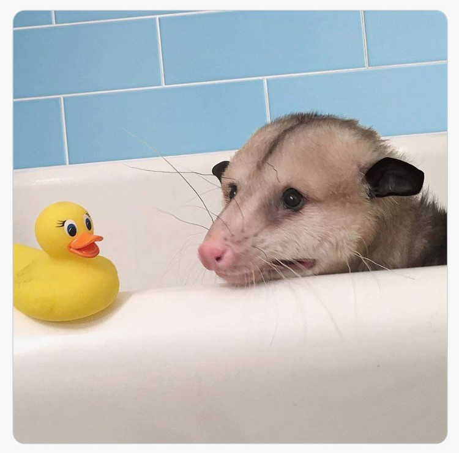
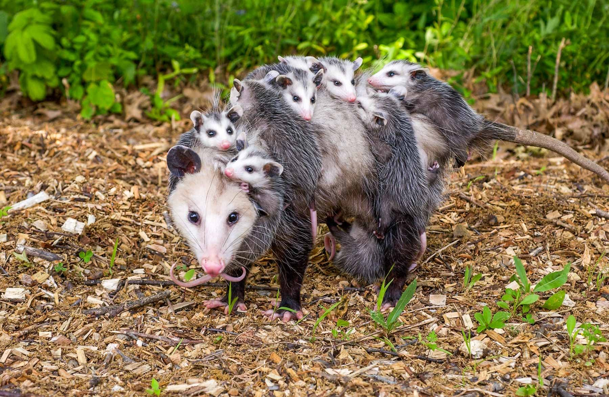
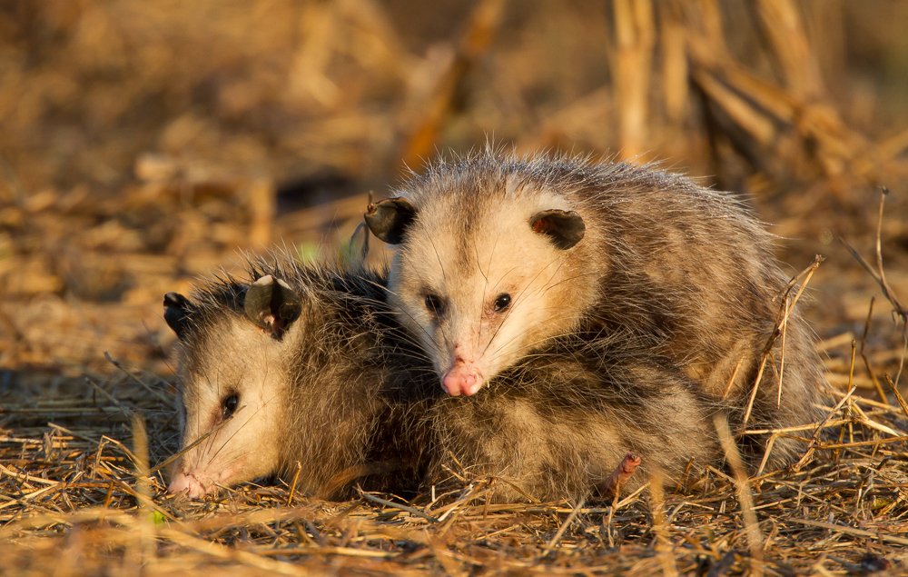

# ДОБРЫЙ ДЕНЬ!

В редакцию поступило срочное обращение, что наш любимый читатель немного грустит и чувствует себя одиноким.
Так быть не должно! Редакция отчаянно и чистосердечно заявляет, что наш любимый читатель самый любимый! И спешит дать ему небольшое напутствие.

<!--more-->

Настоятельно просим не есть любимого читателя из мусорки и вообще хорошо и вкусно кушать! Ему понадобятся силы на самые крепкие объятия, когда главный редактор вернется.

Крайне советуем любимому читателю мыться! А в грустные дни даже купаться!

Желаем любимому читателю не отчаиваться, а в крайних случаях прибегать к объятиям с его квартиросъемщиками - Белкой и Маней. В минуты объятий со второй любимый читатель выглядит именно так:

 
Любимый читатель! Разлука лишь временна, и совсем скоро, уже в понедельник вечером, любимый читатель и главный редактор вестника будут выглядеть примерно так:

 
   Музыкальное сопровождение для сегодняшнего ужина: ОП!

## Люблю мой милый котик! И уже очень сильно скучаю <3
 
*Если вы хотите отписаться от рассылки, пожалуйста позвоните нам на горячую линию 8 (911) 135-25-11.
 У нас нет кнопки для этого, все подписки мы отменяем вручную! С незнакомых номеров не звоните.*
 
 
---

С уважением, Главный редактор "Опоссумьего вестника"
